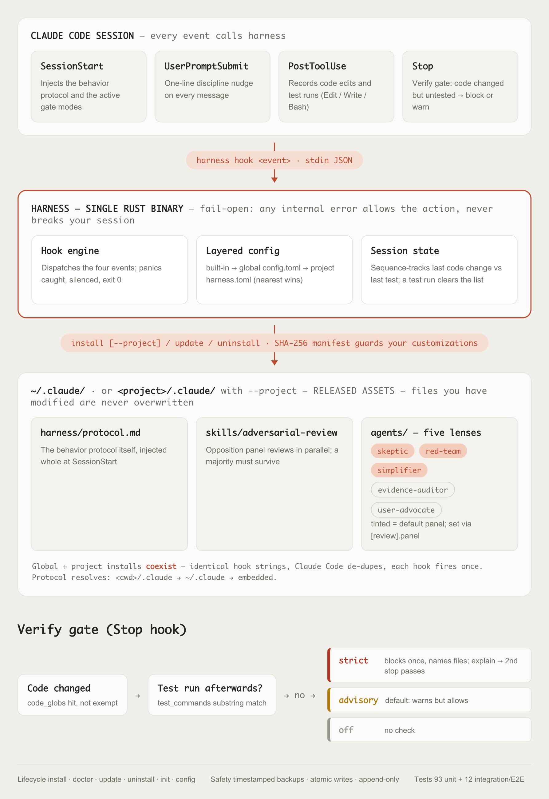

<div align="center">

# harness

**Engineering-discipline engine for Claude Code**

A single Rust binary that makes Claude Code work like a disciplined engineer — look before you leap, say your assumptions out loud, get a second opinion before trusting big conclusions, and prove your work with real tests.


**English** · **[繁體中文](README.zh-TW.md)**

</div>



## What is it

harness is a small engine — a behavior protocol, four hooks, a skill, and five
sub-agents — compiled into one Rust binary and injected into every Claude Code
session automatically. It doesn't teach Claude new tricks. It makes sure Claude
*follows a disciplined process* every single time: gather evidence before
answering, state assumptions instead of guessing, challenge its own big
conclusions before trusting them, and show real proof (not just "looks good to
me") that a change actually works.

Think of it as a behavioral floor, not a framework. It doesn't plan your
sprints or run your CI pipeline — it just keeps the agent honest, careful, and
verifiable while it works. Install once, effective across all your projects;
each project can layer its own customizations on top.

## Why

The protocol is distilled from the careful, disciplined way Anthropic's Fable
model approached tasks. Rather than keep that discipline locked inside one
model, harness extracts it into a reusable protocol and enforces it around
whichever Claude model is driving, session after session.

To be upfront about the limits: hooks and skills can only transplant the
*procedure* (observe first, state assumptions, cross-examine conclusions,
demand verification evidence) — not a model's innate judgment. But in
practice, most of the gap between "good" and "sloppy" agent behavior comes
from skipped procedure, not missing judgment. That's the gap harness closes.

## Why a single binary

Most hook kits for coding agents are piles of shell scripts or Python
entry points — every hook call pays interpreter startup, and things break
the moment bash or the right Python isn't on PATH. harness is one compiled
Rust binary with zero runtime dependencies: no bash, no Python needed at
hook time, and every hook call is a millisecond-level native execution.

## How it works

- **OODA loop** — before answering, Claude runs one OODA pass:

  | Step | What it requires |
  | --- | --- |
  | Observe | Gather evidence with tools first (in parallel where possible) — never guess from training memory |
  | Orient | State assumptions explicitly; list competing readings for you to pick; stop and ask when genuinely unsure |
  | Decide | Turn the task into a verifiable goal (fail-then-pass) — don't stop at "make it work" |
  | Act | Small change → verify → iterate; every line traces back to a requirement |
- **Multi-party adversarial review** — harness's signature move. Before
  trusting a big conclusion (an architecture decision, a root-cause diagnosis,
  anything that could affect production), Claude dispatches independent
  "opposition" sub-agents *in parallel*, each with a different job: a
  **skeptic** who looks for logical holes, a **red-team** who looks for
  security and failure risks, a **simplifier** who looks for needless
  over-engineering, plus an **evidence-auditor** and a **user-advocate** lens.
  The conclusion only gets trusted if a majority of the panel "survives" the
  challenge. Panel membership is set via `[review].panel`.
- **Definition of Done** — if a change touches actual logic, it needs an
  automated test and evidence that the test failed before the fix and passed
  after. Eyeballing the output or a stray `console.log` doesn't count as
  verification. The verify gate enforces this at the end of every turn.
- **Honest reporting** — the first sentence of any report is the actual result
  (not a lead-up); failures get reported as failures, not softened. Without
  evidence, the agent may only say "modified, unverified" — never "done" —
  and an unreviewed conclusion may only be labeled an "unchallenged
  assumption", never stated as fact.
- **Layered configuration** — built-in defaults → global
  `~/.claude/harness/config.toml` → per-project `harness.toml`. The nearest
  layer wins, so each project can tighten or relax the discipline.

## Out of the box

| Feature | What you get |
| --- | --- |
| **Multi-language defaults** | ~25 built-in test commands (`cargo test`, `pytest`, `npm test`, `go test`, `mvn test`, `mix test`, `rspec`, `dotnet test`, …) and ~21 code-file globs across languages, so the verify gate works on most stacks with zero config. `docs/`, `*.md` and `*.txt` are exempt by default — doc edits never trigger the gate. |
| **Precise "changed since last test" tracking** | Sequence numbers record the last code change vs. the last test run, and a test run clears the changed-file list, so when strict mode blocks, it names exactly the files still unverified. Test-command detection is substring-based — `cd backend && cargo test --all` counts — but quoted mentions don't: `git commit -m "make cargo test pass"` is not a test run. |
| **SHA-256 manifest** | `~/.claude/harness/manifest.json` records the official hash of every released asset. That's how install / update / uninstall / doctor know whether *you* modified a file — the mechanism behind "your customizations win". |

## What's inside

| Piece | File | What it does |
| --- | --- | --- |
| Behavior protocol | `assets/protocol.md` → `~/.claude/harness/protocol.md` | Injected at the start of every session, with the active gate modes appended |
| Per-turn nudge | `harness hook user-prompt` | A one-line reminder injected on every user message |
| Activity tracker | `harness hook post-tool` | Records code edits and test runs during the turn — the evidence the gate rules on |
| Verification gate | `harness hook stop` | Blocks the agent from ending a turn where it changed code but never ran a test (once — a second attempt is allowed through) |
| Adversarial review | `assets/skills/adversarial-review/` → `~/.claude/skills/` | The skill that defines the opposition-panel review flow above |
| Opposition agents | `assets/agents/{skeptic,red-team,simplifier,evidence-auditor,user-advocate}.md` → `~/.claude/agents/` | The five independent sub-agent personas used in adversarial review |
| Config layers | `assets/default-config.toml`, `harness.toml` | Built-in → global → project merge; `harness init` generates the project template |
| Lifecycle CLI | `src/commands/` | `install` / `uninstall` / `init` / `doctor` / `update` / `config` |

## Quick start

```bash
cargo install --path .
harness install    # release assets + register hooks + install agents/skills
harness doctor     # health check
```

`harness install` is safe by design: it backs up `settings.json` with a
timestamp first, merges append-only, and never overwrites files you have
modified.

## Commands

| Command | Purpose |
| --- | --- |
| `harness install [--project]` | Release assets into ~/.claude/ and register hooks; `--project` targets the current project's .claude/ instead |
| `harness uninstall [--project]` | Clean removal (only harness-owned items; your customizations and global config are kept) |
| `harness init` | Generate a harness.toml customization layer in the current project |
| `harness doctor [--project]` | Health check: hook registration, version consistency, gate conflicts, install coexistence |
| `harness update [--project]` | Re-release assets after an upgrade (your modified files are kept; official copies land in .new files) |
| `harness config` | Print the merged effective config (built-in → global → project) |
| `harness hook <event>` | Hook engine entry point (invoked by Claude Code; not for manual use) |

## Project-scoped install

`harness install --project` (run from the project root) installs into that
project's `.claude/` instead of `~/.claude/` — hooks, agents, and skills
then apply to that project only. It never creates a config file: the
project config layer is `harness.toml` (run `harness init`). A global and
a project install can coexist; hook commands are identical strings, so
Claude Code de-duplicates them and each hook fires once. `doctor`,
`update`, and `uninstall` accept the same flag to manage the project
install. The released files show up in git status — commit them to share
the setup with your team, or add them to `.gitignore`.

The injected protocol resolves in a fixed order — it does not walk up
parent directories like the config layers do:
`<cwd>/.claude/harness/protocol.md` (session cwd) → `~/.claude/harness/protocol.md`
→ the embedded copy.

`harness doctor` runs four classes of checks: binary-vs-installed version
consistency, asset presence plus customization status (a file you modified
is a warning, not an error), registration of all four hooks, and detection
of foreign Stop hooks that could double-block alongside the verify gate.
Every problem it finds comes with an actionable fix hint (usually "run
`harness install`" or "run `harness update`").

## The verify gate

Changed code without running tests afterwards? At the end of the turn,
the gate reacts according to its mode:

| Mode | Behavior |
| --- | --- |
| `strict` | Blocks, demanding tests (or an explanation to the user; the second stop attempt passes) |
| `advisory` (default) | Warns but allows |
| `off` | No check |

Scope: the gate tracks code changes made through the agent's file tools
(Edit / Write / MultiEdit / NotebookEdit). Mutations performed by arbitrary
Bash commands (`sed -i`, output redirection, scripts) are not tracked —
detecting them reliably would mean snapshotting the tree on every tool call
or guessing writes from command strings, both at odds with the cheap,
fail-open hook budget. The gate is a discipline nudge for a cooperative
agent (which edits files through file tools), not a security boundary.

The quoted-mention rule is deliberately conservative: a test run wrapped in
a quoted shell script (`bash -lc 'cargo test'`,
`docker compose exec app sh -c 'pytest'`) counts as a quoted mention and
does not clear the gate — telling it apart from `sh -c 'echo "cargo test"'`
would require a real shell parser. The gate errs toward blocking once
rather than silently passing. If your project runs tests through such a
wrapper, add the unquoted wrapper prefix to `test_commands`
(e.g. `"docker compose exec app"`) and it matches as usual.

Drop a `harness.toml` in a project root to override anything
(`harness init` generates the template). The project config is discovered
by walking up parent directories from the cwd — the nearest `harness.toml`
wins — so it works from monorepo subdirectories too:

```toml
[gates.verify]
mode = "strict"
test_commands = ["cargo test"]
```

## Adversarial review

Before trusting a major conclusion, the `adversarial-review` skill dispatches
independent lenses in parallel — the conclusion is adopted only when a majority
survive the challenge. The default panel is three lenses; two more ship ready to
enable via `[review].panel`.

| Lens | What it challenges | Default panel |
| --- | --- | --- |
| `skeptic` | Logical holes, unverified inferences | ✓ |
| `red-team` | Security risks, failure modes | ✓ |
| `simplifier` | Over-engineering, needless complexity | ✓ |
| `evidence-auditor` | Whether each claim has evidence (file:line, test output) | — |
| `user-advocate` | Whether it solves the user's actual need; requirement drift | — |

## Design principles

| Principle | What it guarantees |
| --- | --- |
| **Fail-open** | Any internal error in the hook engine allows the action — it never breaks your session. Panics are caught and silenced (hooks always exit 0), invalid config values are ignored, a broken TOML layer is skipped, and state-write failures stay silent. The `stop_hook_active` flag guarantees the verify gate can never block in an infinite loop. |
| **settings.json safety** | Timestamped backups, append-only merging, atomic writes, unknown fields preserved. No change means no backup and no write — a re-run is idempotent and doesn't litter backup files. Marker-based recognition means harness only ever touches its own hook entries, and it creates settings.json if it doesn't exist yet. |
| **Your customizations win** | install/update/uninstall never overwrite or delete files you have modified. |

All of this is covered by a unit-test suite plus integration/E2E tests that
exercise the full install → doctor → update → uninstall lifecycle.
