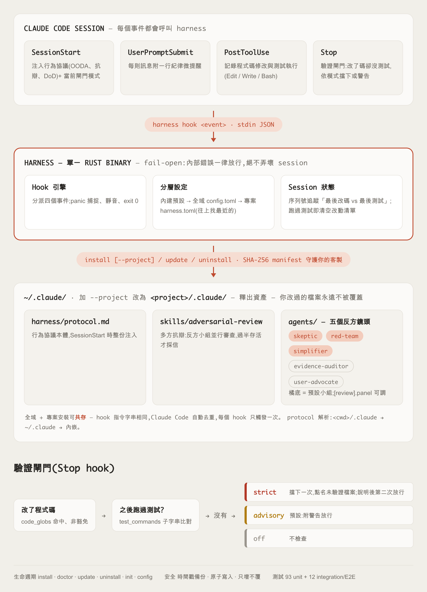

# harness — Claude Code 工程紀律引擎

> 一個 Rust 單一 binary,讓 Claude Code 像個有紀律的工程師一樣工作——動手前先查證、把假設講清楚、重大結論先找人挑戰過再採信、用真正的測試證明改動有效。

[English README](README.md)



## 這是什麼

harness 是一個小型引擎——一份行為協議、四個 hooks、一個 skill、五個子代理——
編譯成單一 Rust binary,在每次開啟 Claude Code session 時自動注入。它不會教
Claude 新招式,而是確保 Claude **每一次都照著一套有紀律的流程走**:先蒐集證據
再回答、把假設講出來而不是用猜的、對自己的重大結論先自我挑戰,並且拿出真正的
證據(而不是「看起來沒問題」)證明改動真的有效。

可以把它想成是「行為的底線」,不是完整的開發框架。它不會幫你排 sprint、不會幫
你跑 CI 流程——它做的是在 agent 工作的過程中,讓它保持誠實、謹慎、可驗證。
安裝一次,所有專案生效;每個專案可疊加自己的客製層。

## 為什麼會有這個引擎

這套協議蒸餾自 Anthropic Fable 模型那種謹慎、有紀律的做事方式。與其把這份紀律
鎖在單一模型裡,harness 把它提煉成一套可重複使用的協議,不管當下是哪個 Claude
模型在主導,每個 session 都維持同一套紀律。

誠實說在前面:hooks 和 skill 只能移植「程序」本身(先蒐證、講假設、交叉質疑
結論、要求驗證證據),沒辦法移植一個模型天生的判斷力。但實務上,「表現得好」
跟「表現得隨便」之間的落差,大多來自程序被跳過,而不是判斷力不足。這正是
harness 想補上的落差。

## 為什麼是單一 binary

坊間給 coding agent 用的 hook 套件,多半是一堆 shell script 或 Python 進入點
——每次 hook 呼叫都要付出直譯器啟動成本,而且只要 bash 不在或 Python 版本不對
就直接壞掉。harness 是一個編譯好的 Rust binary,零執行期依賴:hook 執行時
不需要 bash、不需要 Python,每次 hook 呼叫都是毫秒級的原生執行。

## 運作機制

- **OODA 迴圈**——回答前,Claude 先蒐集證據(實際搜尋/讀取檔案,不靠訓練記憶
  亂猜),把假設講出來,把任務轉成一個可驗證的目標(「讓它能動」這種說法不夠),
  然後小步修改、每一步都驗證。
- **多方抗辯(adversarial review)**——harness 最具特色的機制。在採信一個重大
  結論之前(架構決策、根因判定、任何可能影響上線環境的結論),Claude 會**同時**
  派出多個獨立的「反方」子代理,各自負責不同角度:**skeptic** 專找邏輯漏洞、
  **red-team** 專找安全與失效風險、**simplifier** 專找不必要的過度工程,另外
  還有 **evidence-auditor** 與 **user-advocate** 兩個鏡頭。小組裡要過半「存活」
  (沒被推翻),結論才算採信。小組成員由 `[review].panel` 設定。
- **完成定義(Definition of Done)**——只要改到實際邏輯,就要有自動化測試,
  並且證明「改之前測試會失敗、改之後測試會通過」。單純看輸出順不順眼,或隨手
  一個 `console.log`,都不算驗證。驗證閘門會在每個回合結束時把關。
- **誠實回報**——任何回報的第一句話就是實際結果(不是鋪陳),失敗就照實講,
  不美化。沒有證據時,agent 只能說「已修改、未驗證」,絕不能說「完成」;
  沒經過審查的結論只能標註為「未受挑戰的假設」,不能當事實陳述。
- **分層設定**——內建預設 → 全域 `~/.claude/harness/config.toml` → 專案
  `harness.toml`,愈靠近專案的層級優先,每個專案都能自行收緊或放寬紀律。

## 開箱即用

- **多語言預設值**——內建約 25 組測試指令(`cargo test`、`pytest`、
  `npm test`、`go test`、`mvn test`、`mix test`、`rspec`、`dotnet test`……)
  與約 21 組跨語言的程式碼檔案 globs,大多數技術棧零設定就能用驗證閘門。
  `docs/`、`*.md`、`*.txt` 預設豁免——改文件永遠不會觸發閘門。
- **精準的「上次測試後改了什麼」追蹤**——用序號記錄最後一次程式碼修改與
  最後一次測試執行的先後,跑過測試就清空修改清單;所以 strict 模式擋下時,
  能明確列出還沒驗證的檔案。測試指令採子字串比對:
  `cd backend && cargo test --all` 也算數;但引號內的提及不算——
  `git commit -m "make cargo test pass"` 不會被當成測試執行。
- **SHA-256 manifest**——`~/.claude/harness/manifest.json` 記錄每個釋出資產
  的官方雜湊值。install / update / uninstall / doctor 就是靠它判斷檔案是不是
  **你**改過的——也是「你的客製優先」背後的機制。

## 裡面有什麼

| 元件 | 檔案 | 作用 |
| --- | --- | --- |
| 行為協議 | `assets/protocol.md` → `~/.claude/harness/protocol.md` | 每次 session 開始時注入,並附上當前閘門模式 |
| 每輪微提醒 | `harness hook user-prompt` | 使用者每則訊息都會被注入一行提醒 |
| 活動追蹤 | `harness hook post-tool` | 記錄這輪的程式碼修改與測試執行——閘門判斷用的證據 |
| 驗證閘門 | `harness hook stop` | 若這輪改了程式碼卻沒跑測試,擋下收工一次(第二次會放行) |
| 多方抗辯 | `assets/skills/adversarial-review/` → `~/.claude/skills/` | 定義上述反方審查流程的 skill |
| 反方子代理 | `assets/agents/{skeptic,red-team,simplifier,evidence-auditor,user-advocate}.md` → `~/.claude/agents/` | 抗辯流程用的五個獨立子代理角色 |
| 設定分層 | `assets/default-config.toml`、`harness.toml` | 內建 → 全域 → 專案合併;`harness init` 產生專案範本 |
| 生命週期 CLI | `src/commands/` | `install` / `uninstall` / `init` / `doctor` / `update` / `config` |

## 快速開始

```bash
cargo install --path .
harness install    # 釋出資產 + 註冊 hooks + 安裝 agents/skills
harness doctor     # 體檢
```

`harness install` 天生安全:先做時間戳備份 `settings.json`、只增不覆地合併,
絕不覆蓋你改過的檔案。

## 指令

| 指令 | 作用 |
| --- | --- |
| `harness install` | 釋出資產到 ~/.claude/、註冊 hooks |
| `harness uninstall` | 乾淨移除(只刪自己的東西,保留你的客製與全域設定) |
| `harness init` | 在當前專案產生 harness.toml 客製層 |
| `harness doctor` | 體檢:hooks 註冊、版本一致、閘門衝突 |
| `harness update` | 升版後重釋資產(你改過的檔案保留,官方新版存 .new) |
| `harness config` | 顯示合併後設定(內建 → 全域 → 專案) |
| `harness hook <event>` | hook 引擎入口(Claude Code 呼叫,不需手動使用) |

`harness doctor` 執行四類檢查:binary 與已安裝資產的版本一致性、資產是否
齊全與客製狀態(你改過的檔案算警告,不算錯誤)、四個 hooks 是否全數註冊、
以及偵測外來的 Stop hook(警告它可能與驗證閘門同時擋下)。每個查出的問題
都附上可直接執行的修復提示(通常是「run `harness install`」或
「run `harness update`」)。

## 驗證閘門

改了程式碼卻沒在其後跑測試?回合結束時依模式處理:

- `strict`:擋下,要求補測試(或向使用者說明原因後,第二次結束放行)
- `advisory`(預設):附警告放行
- `off`:不檢查

適用範圍:閘門追蹤的是 agent 透過檔案工具(Edit / Write / MultiEdit /
NotebookEdit)所做的程式碼變更。任意 Bash 指令造成的檔案異動(`sed -i`、
輸出重導向、腳本)不在追蹤範圍——要可靠偵測,得在每次工具呼叫時對整個
目錄樹做快照,或從指令字串猜測寫入行為,兩者都違背 hook 必須輕量、
fail-open 的預算。閘門是給合作型 agent(本來就用檔案工具改檔)的紀律
提示,不是安全邊界。

專案根目錄放 `harness.toml` 即可覆寫(`harness init` 產生範本)。專案設定
會從 cwd 往上層目錄逐層尋找,最近的 `harness.toml` 優先,所以在 monorepo
的子目錄下也能運作:

```toml
[gates.verify]
mode = "strict"
test_commands = ["cargo test"]
```

## 對抗審查

五個 agent 鏡頭(skeptic / red-team / simplifier / evidence-auditor /
user-advocate)+ `adversarial-review` skill,重大結論過半存活才採信。
小組成員由 `[review].panel` 設定。

## 設計原則

- **Fail-open**:hook 引擎任何內部錯誤一律放行,絕不弄壞你的 session。
  具體來說:panic 會被攔截並靜音(hook 永遠 exit 0)、無效的設定值直接忽略、
  壞掉的 TOML 層直接跳過、狀態寫入失敗也保持沉默;`stop_hook_active` 旗標
  保證驗證閘門絕不會陷入無限擋下的迴圈。
- **settings.json 安全**:時間戳備份、只增不覆、原子寫入、保留未知欄位。
  沒有變更就不備份、不寫入——重複執行是冪等的,不會堆一堆備份檔。靠標記
  (marker)辨識,只會動到自己的 hook 項目;settings.json 不存在時會自動
  建立。
- **你的客製優先**:install/update/uninstall 都不會覆蓋或刪除你改過的檔案。

以上全部由單元測試套件加整合/E2E 測試把關,涵蓋完整的
install → doctor → update → uninstall 生命週期。
